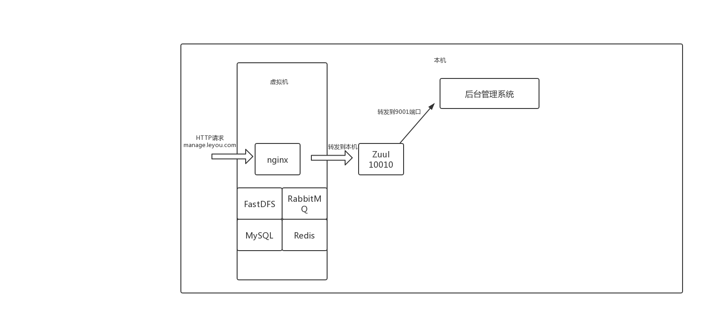
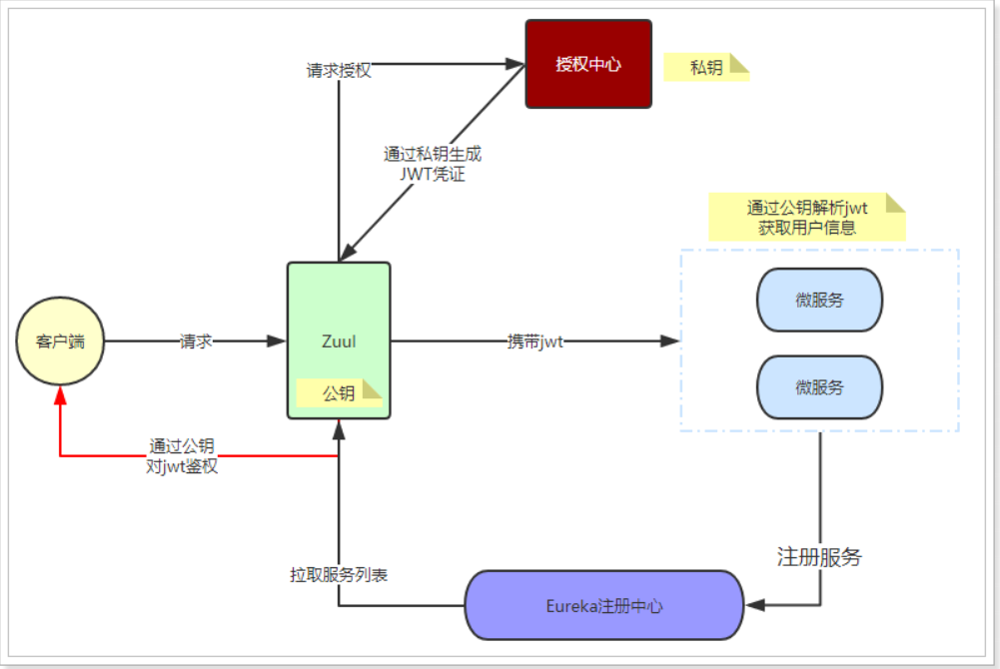
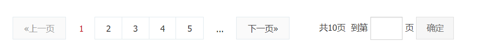
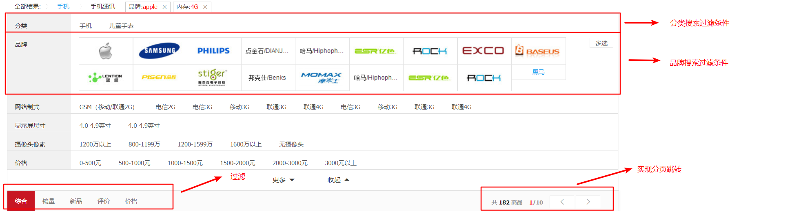

# 0x0 引言

## 1.学习目的
1. 直接目的：搭建一个B2C购物网站
2. 间接起因：复习JavaWeb开发Spring框架，了解学习前沿技术：SpringBoot、SpringCloud、消息队列等中间件

## 2.项目总览
### 2.1 项目架构

项目进度： 60%

前台域名：www.mio4.com

后台管理域名： manage.leyou.com

服务器：阿里云1核2GB CentOS 6.9 

- [x] DNS域名绑定
- [x] 域名备案
- [ ] 开启80、8080 | 8001、9002、10086、10010端口
- [x] 配置FastDFS，tracker端口22122，storage端口23000
- [x] 配置Nginx
- [x] RabbitMQ
- [ ] Redis
- [x] MySQL
- [x] JDK 8
- [x] lrzsz
- [ ] ElasticSearch
- [ ] FastDFS

```
(1)nginx
	/opt/nginx/nginx.conf
	[1]配置支持php-fpm 6666
		http://39.105.222.221
		File Not Found
		(1)www文件权限
		(2)以root用户开启php-fpm /usr/local/php/sbin/php-fpm -R
	[2]
	
(2)mysql
	通过yum install mysql-server
(3)lrzsz
	yum -y install lrzsz
(4)php-fpm
	/user/local/php
	教程：http://www.wj008.net/article/index/5
	编译安装 make && make install
	开启自启动 chkconfig php-fpm on 
	版本 php -v 7.2.8
	默认端口：9000
	启动：/etc/init.d/php-fpm start
	关闭：/etc/init.d/php-fpm stop
	[-]配置支持Redis
(5)JDK 8
	/usr/local/java/jdk1.8.0_211
	vim /etc/profile
	source /etc/profile
(6)ElasticSearch
(7)FastDFS

---
文件夹传输：从mac到centos
scp -r "/Users/zhangjin19/Desktop/实习/12 新人串讲-opencdn项目总结/mio-opencdn-api/www" root@39.105.222.221:/path

scp -r "/Users/zhangjin19/Desktop/实习/12 新人串讲-opencdn项目总结/mio-opencdn-api/www" root@39.105.222.221:/home/leyou/lnmp
---
开放chrome 特殊端口
/Applications/Google\ Chrome.app/Contents/MacOS/Google\ Chrome --explicitly-allowed-ports=6666
---
nginx.conf配置文件-todo
	http://39.105.222.221:6666/定向到http://39.105.222.221:80端口问题
	http://39.105.222.221:6666/ File Not Found问题
	
```

整体架构：
1. 虚拟机模拟



(1) 本机通过浏览器发送一个HTTP请求，比如manage.leyou.com

(2) Windows hosts文件中manage.leyou.com解析到IP 10.136.51.13 

(3) 浏览器访问10.136.51.13:80，发送的HTTP Request Header中带着Host：manage.leyou.com键值对

(4) 虚拟机Nginx接受到请求，Host匹配nginx.conf中的server_name，请求以本机IP:9001的形式转发到本机

(5) 本机接受到http请求，（网关）处理http请求，返回结果

2. 线上环境

```
# TODO

```


### 2.2 实现功能
1. 商品后台管理系统
	商品管理：商品分类、品牌、商品规格信息管理（增删改查）
	用户管理：
2. 前台商品购物门户
	商品搜索
	购物车
	下单
	售后评价

### 2.3 技术栈
**前端**：
1. HTML、CSS、ES6
2. Vue.js和Vuetify UI框架
3. 前端构建：WebPack
4. Vue脚手架：Vue-Cli
5. 开源富文本编辑器：quill-editor

**后端**：
1. SpringMVC + Spring 5.0 + MyBatis3
2. SpringBoot 2.0.4.RELEASE
3. SpringCloud：Eureka、Hystrix、Feign、Zuul
4. ElasticSearch 5.6.8
5. Kibana
4. Redis 4.0
5. RabbitMQ 3.4
6. Nginx 1.10.2
7. FastDFS 5.0.8
8. JWT

### 2.4 特点

1. 通过Node.js和Vue.js实现了前后端分离开发
2. 使用SpringCloud实践了微服务的思想
3. 使用FastDFS解决了大数据量下的分布式文件存储问题
4. 使用微信SDK实现了下单之后微信扫码支付
5. 基于ElasticSearch的高级聚合，实现商品的智能搜索过滤

### 2.5 难点

1. ElasticSearch实现商品搜索功能
2. 如何通过后台处理跨域请求，解决403 Forbidden问题
3. 将整个服务部署到阿里云服务器——环境配置+域名解析

# 0x1 后端

## 线上部署

```
本地虚拟机环境和阿里云线上环境之间有很多区别，需要注意的事项：
（1）保持阿里云和虚拟机操作系统相同（CentOS 6）
（2）保持软件安装配置相同（MySQL Redis RabbitMQ等）
（3）本地环境和线上环境的区别（主要是IP、端口以及文件路径）,路径可以保持一致，所以主要需要解决IP问题

需要注意的部分：
（1）/opt/nginx/nginx.conf 域名、ip、端口，开放阿里云端口
（2）商品页面静态化时，文件保存路径（leyou-page com.leyou.page.service.PageService）
（3）RabbitMQ配置文件Host等（leyou-item-service application.yml RabbitMQ）
（4）RabbitMQ配置文件Host等（leyou-item-search application.yml RabbitMQ）
（5）RabbitMQ配置文件Host等（leyou-item-page application.yml RabbitMQ）
（6）application.yml中datasource数据库密码配置（线下密码和线上密码不同）
（7）阿里云线上数据库允许外部连接方式
（8）JWT认证系统——公钥和私钥的生成地址（leyou-auth-service/application.yml中配置）

（1）SpringBoot项目，首先用maven打包jar，然后在服务器使用`java -jar xxx.jar`运行单个模块项目
```


## 微服务架构

### 微服务关系


````
1. 模块之间相互依赖，模块之间是如何调用的？（比如从UserController->UserApi->跨模块UserClient，调用其他模块的函数）
2. @
````


### 反向代理服务器-Nginx

```cmd
# Nginx配置文件
/opt/nginx/bin/nginx.conf 
# 重启Nginx
nginx -s reload
# Nginx配置文件说明

```

Nginx配置文件说明

```cmd
#user  nobody;
user root;
worker_processes  1;

events {
    worker_connections  1024;
}

http {
    include       mime.types;
    default_type  application/octet-stream;
    sendfile        on;
   
    keepalive_timeout  65;

    gzip  on;

    server {
        listen       80;
        server_name  image.leyou.com;

       # location /group1/M00/ {
       #      root /home/leyou/fastdfs/storage/data;
       #      ngx_fastdfs_module;
       # }

        location ~/group([0-9])/ {
             ngx_fastdfs_module;
        }

        location / {
            root   /leyou/static;
	    index  index.html index.htm;
        }

        error_page   500 502 503 504  /50x.html;
        location = /50x.html {
            root   html;
        }
        
    }
    server {
        listen       80;
        server_name  www.leyou.com;

        proxy_set_header X-Forwarded-Host $host;
        proxy_set_header X-Forwarded-Server $host;
        proxy_set_header X-Forwarded-For $proxy_add_x_forwarded_for;

        location /item{
            proxy_pass http://10.135.239.33:8084;
            proxy_connect_timeout 600;
            proxy_read_timeout 600;
        }

        location / {
            proxy_pass http://10.135.239.33:9002;
            proxy_connect_timeout 600;
            proxy_read_timeout 600;
        }
    }
    server {
        listen       80;
        server_name  manage.leyou.com;

        proxy_set_header X-Forwarded-Host $host;
        proxy_set_header X-Forwarded-Server $host;
        proxy_set_header X-Forwarded-For $proxy_add_x_forwarded_for;

        location / {
            proxy_pass http://10.135.239.33:9001;
            proxy_connect_timeout 600;
            proxy_read_timeout 600;
        }
    }
    server {
        listen       80;
        server_name  api.leyou.com;

        proxy_set_header X-Forwarded-Host $host;
        proxy_set_header X-Forwarded-Server $host;
        proxy_set_header X-Forwarded-For $proxy_add_x_forwarded_for;

        location / {
            proxy_pass http://10.135.239.33:10010;
            proxy_connect_timeout 600;
            proxy_read_timeout 600;
        }
    }
}
```

### 消息队列-RabbitMQ

为什么要使用消息队列

- 商品详情页面使用了静态化，商品数据发生变化之后，保存在本地的静态化页面不会发生变化。
- 搜索服务的数据来源是索引库，如果商品详情发生变化，索引库数据不会自动更新。

不同消息队列之间的对比（为什么使用RabbitMQ）：

- RabbitMQ：基于AMQP协议，erlang开发，稳定性好
- RocketMQ：基于JMS（Java MessageService）（阿里巴巴淘宝团队）
- Kafka：分布式消息系统，高吞吐量

```cmd
# 虚拟机rabbitmq慢启动优化
https://blog.csdn.net/qq_37606901/article/details/87309881

service rabbitmq-server start
service rabbitmq-server stop
service rabbitmq-server restart

管理界面默认端口：15672
默认用户 guest : guest

```

消息队列在项目中的使用：

```
（1）后台管理系统增加、修改、删除商品信息时：
	【1】leyou-page，通知商品详情页进行更新
	【2】leyou-search，通知商品索引进行更新
（2）用户注册、登录
	【1】短信微服务，向leyou-sms发送消息
```


### 缓存数据库-Redis

```
为什么要使用Redis?
（1）用户注册时，验证码保存到Redis中，设置一定缓存时间，实现用户注册功能
（2）
```

### 聚合数据-短信SMS服务


```
> 阿里云/百度SMS服务需要企业认证，并且付费较高，使用“聚合数据”
https://www.juhe.cn/docs/api/id/5

需要解决的问题：
1. 如何判断短信是否发送成功——消息队列的反馈消息
2. 短信限流机制
3. 剩余短信条数不足5

备用平台：
https://www.yunpian.com/console/#/admin
```

### 用户注册

```
1. 使用Hibernate Validator（注解开发）进行后端数据校验
```

### 授权中心

#### 1. JSON Web Token

Header + Payload + Signature

RSA非对称加密算法：私钥加密的内容可以用公钥解密

#### 2. HTTP请求流程




用户登录以及普通请求：

- 首先利用RSA生成公钥和私钥。私钥保存在授权中心，公钥保存在**Zuul网关**和各个**微服务**

- 用户请求登录
  - 授权中心校验，通过后用私钥对JWT进行签名加密
  - 返回jwt给用户

- 用户携带JWT访问
  - Zuul直接通过公钥解密JWT，进行验证，验证通过则放行
  - 请求到达微服务，微服务直接用公钥解析JWT，获取用户信息，无需访问授权中心

##### 1.为什么要使用JSON Web Token？

- 可以使用共享Session的方案
  - 通过组播的方式进行集群间的共享，网络开销大
  - 持久化到共享存储设备上，磁盘IO开销以及数据备份

##### 2. 为什么要使用RSA？

- 使用对称加密的方案
  - 不够安全
  - 每次鉴权都需要访问鉴权中心，负载能力要求高
- 将鉴权的逻辑分散到Zuul网关和微服务，减轻鉴权中心压力


## application.yml配置详解

```
（1）Spring相关配置
（2）Eureka相关配置
（3）RabbitMQ相关配置
```

## Spring常用注解

### @Controller | @Service

```
（1）@Controller注解Controller类
（2）@Service注解Service类
```

### @Autowired

```

```

### @EnableDiscoveryClient

```

```


### @EnableZuulProxy

```

```

### @FeignClient("user-service")

```

```


### @SpringCloudApplication

```

```


### @RestController

```
（1）配合ResponseEntity使用

```

### @PostMapping

```

```

### @RequestBody 

```

```

### @Component 

```
（1）注解到XXXListener中，将RabbitMQ监听器添加到Spring容器中
```

### @RabbitListener

```
（1）注解listen方法，绑定接受指定队列、交换机的消息接受方法，会自动执行
（2）子注解
	@QueueBinding
	@Queue
	@Exchange
```

### @Transactional

```

```

### @Data | @NoArgsConstrutor | @AllArgsConstructor

```
（1）git
```


### @Runwith | @SpringBootTest

```
@RunWith(SpringRunner.class)
@SpringBootTest
（1）测试类运行的注解条件
```


### 

## Spring工程

```
需要关注哪些方面：
1. pom.xml——maven配置文件
2. application.yml配置文件
3. XXXApplication启动类
4. 常用的注解
5. 聚合模块的配置
```

## Spring测试

```
@Runwith(SpringRunner.class)
@SpringBootTest
```

## Spring日志记录

```
@Slf4j
1. 日志如何记录到本地
2. 控制日志记录的类型
```


# 0x2 manage.leyou.com 后台管理系统


## 2.1 管理系统交互API

| 功能 | 请求方法 | 请求路径  | 请求体 | 说明  | 响应体  | 说明|
| --- | ------- | -------- | ----- | ---- | ----- | ----- |
| 获取商品列表：需要后端分页 | GET  | /spu/page | key<br/>saleable<br/>page<br/>row<br/> | key：商品名称(模糊)，<br/>saleable：是否上架，<br/>page：当前页数，<br/>row：一页显示多少条 | {"total": 0,<br/>"totalPage": null,<br/>"items": [{<br/>"id": 129,<br/>"brandId": 18374,<br/>"cid1": 74,<br/>"cid2": 75,<br/>"cid3": 76,<br/>"title": "小米（MI） 红米5 plus 手机 （更新）",<br/>"subTitle": "18:9全面屏，4000mAh大电池，骁龙八核处理器",<br/>"saleable": true,<br/>"valid": true,<br/>"createTime": "2018-04-21T07:59:38.000+0000",<br/>"cname": "手机/手机通讯/手机",<br/>"bname": "小米（MI）"}]<br/>}| total：商品总条数<br/>totalPage：总共多少页<br/>items：商品列表，每个item包含商品的详细信息 |
| 新增商品：需要填写商品详细信息 | POST     | /item/goods |  TODO   | { <br/>  "brandId": 8557,<br/>"title": "华为超级P",<br/>"subTitle": "不知道写啥", <br/> "spuDetail":[...],<br/>"skus": [{...}]<br/>"cid1":74,<br/>"cid2":75,<br/>"cid3":76<br/>} |         |             |


# 0x3 www.leyou.com 前台门户网站

## 3.1 ElasticSearch







### 实现搜索功能

向后台发送API

前端实现分页

```cmd
www.leyou.com
www.leyou.com/search.html?key=xxx&page=1

```

```cmd
TODO
修复报错
--day 14搜索过滤--
java.lang.ClassCastException: org.elasticsearch.search.aggregations.bucket.terms.UnmappedTerms cannot be cast to org.elasticsearch.search.aggregations.bucket.terms.StringTerms


```

## 3.2 商品详情页

### ThymeLeaf

thymeleaf一般用法：将model中的属性提取显示到html中

```
# 在Spring工程中使用ThymeLeaf

1. SpringBoot创建子moudle
2. pom.xml中导入thymeleaf依赖
3. HTML文件导入"xmlns:th="http://www.thymeleaf.org"命名空间
4. applicaiton.yml中关闭页面缓存
(5).更新页面之后Ctrl+Shift+F9重新编译html页面
```

为了降低服务器的压力，实现页面的静态化（将HTML页面作为静态内容保存到服务器）

```

```


## 3.3 Vue

### 注解

```cmd
@mouseenter

@keyup
```


```cmd
插值表达式{{}}

data:{}
create(){}
watch:{}
methods:{}
```


# 0x4 技巧

## IDEA常用快捷键

```cmd
# 编辑器
sout => System.out.println
psvm => public static void main(){}
new xxx.var => xxx x = new xxx
# 列编辑模式
Alt + CapsLock + 鼠标左键
```

## Vue

```cmd
Chrome Vue插件
```

## Linux开机启动配置

```cmd
TODO
# MySQL
# ElasticSearch
# Ngnx
```

# 0x5 修复

```
（1）manage.leyou.com 后台管理系统修改删除商品
（2）elasticSearch 商品查询服务debug
```


## JDK 8 TODO
参考JDK8的思维导图如下：

主要研究函数式编程和其他思想


## AJAX
axios 一些小的Demo如下：


---

分割线

---

# 个人备忘录


```cmd
# 运行manage.leyou.com项目
npm run dev
# 运行www.leyou.com
live-server --port=9002
# 获取spu列表
http://localhost:8081/spu/page?page=1&rows=100&saleable=true #能够查询到结果
http://item-service/spu/page?page=1&rows=100&saleable=true #访问超时，不能查询到结果
```


### 学习进度  2019/5/19

1. SpringBoot自动配置原理——yaml文件配置
2. SpringMVC——拦截器配置、Slf4j日志、通用Mapper配置、注解复习
3. 系统架构：集中式架构——>SOA架构——>微服务架构（RPC | HTTP）
4. Spring访问Rest服务的客户端——RestTemplate
5. SpringCloud入门——基于SpringBoot的微服务容器
    父子工程——服务提供方&服务接收方
6. Eureka服务管理中心——能够管理消费者-生产者模型：pom.xml中添加maven依赖，添加@EnableDiscoveryClient注解，配置application.yml文件——改进：Consumer动态获取Service地址——搭建Eureka中心集群（eg：两个eureka-server，两个eureka-client）
7. Eureka——Ribbon负载均衡 | 对于Ribbon源码的分析：轮询算法&随机算法
8. Histrix熔断器——设置最长等待时间，定义错误情况下处理函数
9. Feign——对Rest请求进行隐藏，假扮在访问本地服务
10. Zuul——使用微服务网关：（1）控制所有微服务路由 （2）过滤器鉴权和限流（3）自定义过滤器
11. Vue基础知识
12. FastDFS
13. Vuetify：Vue框架
14. Element-Ui：饿了么前端框架
15. ElasticSearch

# 项目进度

## 前端

- [x] manage.leyou.com
- [x] IP访问——>二级域名访问

## 后台

- [x] 搭建基础架构
- [x] 实现工具类，通用异常处理类
- [x] 虚拟机CentOS的Nginx代理请求
- [x] 实现FastDFS分布式文件上传功能（配置Ngnix+FastDFS-module）
- [x] 设计商品表结构
- [ ] 购物车功能（复习Cookie和Session）

# 笔记

```cmd
# 运行vue项目
npm run dev 
# windows host文件
C:\Windows\System32\drivers\etc\hosts
# switchHosts
# Nginx
E:\nginx-1.14.2\conf\nginx.conf
```

###  Windows下Nginx配置

```
	./nginx.exe
	./nginx.exe -s reload
	./nginx.exe -s quit
```

### mysql导入sql脚本

```cmd
# mysql 安装路径
C:\Program Files\MySQL\MySQL Server 5.5

drop database amall;
create database amall character set utf8;
use amall;
source ‪E:\GitHub\a-mall\info\amall.sql;
```

### 设计表结构

```cmd

```

### 前后台交互API

```cmd
http://localhost:8081/category/list?pid=0 # 直接访问
http://localhost:10010/api/category/list?pid=0 # 从网关转发
```

### FastDFS

```cmd
本机IP ：
虚拟机IP：
VMware NetWork Adapter VMNet1
192.168.211.1
VMware NetWork Adapter VMNet8
192.168.92.1
无线局域网适配器WLAN
10.135.93.200 | 10.136.51.13
Ubuntu虚拟机
192.168.92.128
Ubuntu共享文件夹
计算机-> mnt/hgfs/Ubuntu Virtual Share
E:\Ubuntu Virtual Share
```


```cmd
# 相关配置
# 防火墙
service iptables status | service iptables off
chkconfig iptables off
# Centos IP
192.168.92.129
# 本机IP——动态更新
10.136.51.13
10.135.51.174
10.135.51.174
10.135.239.33
# FastDFS
/etc/fdfs ——配置文件
/etc/init.d/fdfs_trackerd ——启动文件
service fdfs_trackerd start ——启动服务
# IP变更之后需要的fix
本机IP和CentOS虚拟机IP可能是动态IP，需要更改的配置：
1. 本机IP改变
	(1)CentOS /opt/nginx/conf/nginx.conf中proxy_pass 修改为新的本机IP
	# vim替换批处理脚本
	
2. CentOS IP改变
	(1)FastDFS中tracker storage配置文件：
		/etc/fdfs/storage.conf —— tracker_server修改为新的虚拟机IP
		/etc/fdfs/tracker.conf —— 不需要修改（可以配置新的端口）
		/etc/fdfs/client.conf  —— tracker_server修改为新的虚拟机IP
	(2)SwitchHost.exe中修改hosts映射文件	
```


# 项目中关注的一些细节

1. 项目是前后端分离的，从manage.leyou.com向api.leyou.com发起跨域请求是如何处理的？

    - [ ] JSONP （只能发送GET）
    - [ ] Nginx反向代理（需要配置nginx.conf）
    - [x] CORS（cross origin resource sharing）

2. 如何发送Ajax请求

    axios

3. 研发顺序

    数据库打表——>通过表构造JavaBean——>通用Mapper——>Service——>Controller——>前后端对接测试

4. 


# 0x Detail

## JDK 8

## ElasticSearch

## 跨域问题

## AJAX


